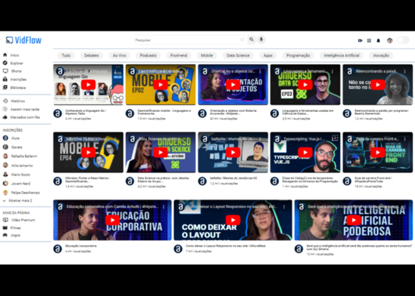

# Vid-flow 

## Sobre o projeto
Projeto criado durante o curso "Consumindo e tratando dados de uma API" feito na plataforma de cursos da [Alura](https://www.alura.com.br/).
O projeto é uma aplicação web chamada VidFlow que é uma plataforma de streaming de vídeos. Nessa plataforma, você pode filtrar os vídeos pela barra de pesquisa ou pelos botões de categoria.

## Tecnologias utlizadas
- [HTML](https://developer.mozilla.org/pt-BR/docs/Web/HTML)
- [CSS](https://developer.mozilla.org/pt-BR/docs/Web/CSS)
- [Node.js](https://nodejs.org/en)
- [Git](https://git-scm.com/downloads)
- [npoint](https://www.npoint.io/)

## Aprendizados
Durante o curso foi abordado diversos conceitos para serem aplicados na construção do projeto.
Como o foco do curso foi o aprendizado de consumir uma API com Javascript, alguns temas abaixo foram os que tiveram mais foco. São eles:

* [Fetch API](https://developer.mozilla.org/pt-BR/docs/Web/API/Fetch_API/Using_Fetch) - Método utilizado para realizar requisições de um determinado local e em seguida obter a resposta dessa requisição.

* [Async/await](https://developer.mozilla.org/pt-BR/docs/Web/JavaScript/Reference/Statements/async_function) - São métodos utilizados para ter um melhor controle das requisições assíncronas que existem dentro do Javascript. Requisições que tem 'promisses' como respostas e essas respostas são utilizadas dentro do código, precisam ser controladas para que a continuidade da execução da aplicação não seja comprometida.

## Executando o projeto
Após o o download/clone dos arquivos do repositório, apenas abra o arquivo index.html no navegador. Apesar de existir uma pasta chamada "backend" com um arquivo .json com as informações para serem carregadas no container dos vídeos, não é necessário executar esse arquivo .json pois o mesmo encontra-se hospedado no [npoint](https://www.npoint.io/).